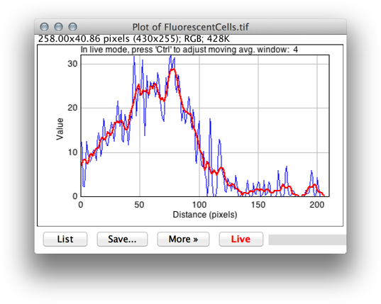

# Analysis

[BARs][Home] that complement built-in commands related to image analysis.

See also: [Data Analysis]

###[Multichannel Plot Profile](./Multichannel_Plot_Profile.bsh)
   Extends the built-in command _Analyze> Plot Profile_ to multichannel (composite) images. It
   features a _Live mode_, guesses displayed lookup tables and ignores disabled channels, i.e.,
   those deselected in the "Channels" widget (which can be called by pressing `Z`, the shortcut for
   _Image> Color> Channels Tool_).

   Notes:

   * Y-axis upper limit is set by the active channel. If a profile from a brighter channel appears
     truncated, turn on _Live mode_, and activate the brighter channel using the _C slider_ of the
     image.
   * By default, rectangular areas and lines wider than 1 pixel are plotted using column averages.
     To use row averages instead hold down `Alt`. This works in _Live mode_ and mimmics the behavior
     of the  built-in _Analyze> Plot Profile_ command. To use column averages at all times, activate
     the _Vertical Profile_ checkbox in _Edit>Options>Profile Plot Options..._
   * _Live mode_ will stop as soon as a valid ROI (straight line or rectangular selection) stops
     being present. It will resume when a new new one is reinstated.
   * If one of the channels uses and unconvential LUT the script will plot its profile using black.
     To change the color of the plotted curves, turn on _Live mode_, activate the image, and apply a
     new LUT using the drop-down menu of the "Channels" widget.
   * By default, the X-axis will use spatially calibrated distances. To use pixel distances instead
     hold down the "Alt" key when running the plugin from the _BAR>Analysis>_ menu.

###[Multichannel ZT-axis Profile](./Multichannel_ZT-axis_Profile.bsh)
   Extends the built-in command _Image>Stack>Plot Z-axis Profile_ to multichannel (composite) images,
   while providing extra functionality such as Z-averaging (3D timelapses images), choice of
   statistic to be plotted and ability to trigger custom routines while in live mode.

   Notes:

   * Intensities (mean, min, max or StdDev) are retrieved from active ROI or entire canvas if no ROI exists
   * With timelapse hyperstacks, intensities can be averaged across Z-slices at each time point
   * Limits of Y-axis are automatically set to include data from all visible channels
   * Similarly to [Multichannel Plot Profile](#multichannel-plot-profile), only visible channels
     (those active in the _Image> Color> Channels Tool_ widget) are plotted

###[Smoothed Plot Profile](./Smoothed_Plot_Profile.bsh)
   A BeanShell script that extends the built-in command _Analyze> Plot Profile_ by plotting a simple
   [moving average](http://en.wikipedia.org/wiki/Moving_average) of profiled data. It inherits most
   features of [Multichannel Plot Profile](#multichannel-plot-profile).

   Notes:

   * In _Live mode_, and with profiled image as the frontmost window, press press `Control` to
     readjust the number of data points to be used in the moving average calculation.
   * The script also exemplifies how to call methods defined by a [BAR lib](../lib/README.md#lib):
     The simple moving average calculation is performed by `getSimpleMovingAverage()`, loaded from
     [BARlib.bsh](../lib/BARlib.bsh).

| [Home] | [Analysis] | [Data Analysis] | [Annotation] | [Segmentation] | [Tools] | [Plugins][Java Classes] | [lib] | [Snippets] | [IJ] |
|:------:|:----------:|:---------------:|:------------:|:--------------:|:-------:|:-----------------------:|:-----:|:----------:|:----:|

[Home]: https://github.com/tferr/Scripts#ij-bar
[Analysis]: https://github.com/tferr/Scripts/tree/master/Analysis#analysis
[Data Analysis]: https://github.com/tferr/Scripts/tree/master/BAR/src/main/resources/scripts/BAR/Data_Analysis#data-analysis
[Annotation]: https://github.com/tferr/Scripts/tree/master/Annotation#annotation
[Segmentation]: https://github.com/tferr/Scripts/tree/master/Segmentation#segmentation
[Tools]: https://github.com/tferr/Scripts/tree/master/Tools#tools-and-toolsets
[Java Classes]: https://github.com/tferr/Scripts/tree/master/BAR#java-classes
[lib]: https://github.com/tferr/Scripts/tree/master/lib#lib
[Snippets]: https://github.com/tferr/Scripts/tree/master/Snippets#snippets
[IJ]: http://imagej.net/BAR
