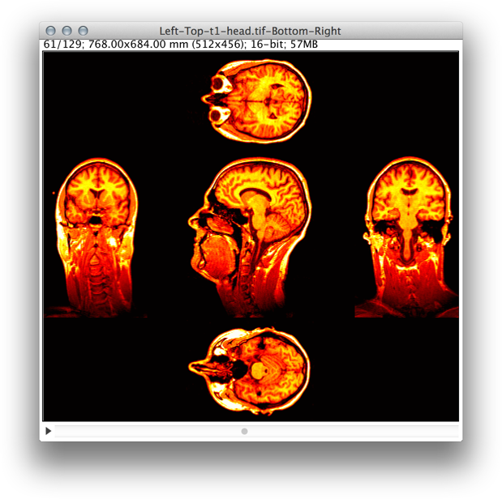

# Annotation

[BARs][Home] related to annotation of images.

###[Combine Orthogonal Views](./Combine_Orthogonal_Views.ijm)
   Appends top, bottom and side views to a stack in a similar way to _Image>Stacks>Ortogonal Views_
   but extending projected views to the entire volume rather than displaying single slices. Empty
   spaces in the image canvas will be painted with background color (frame around the Color Picker
   Tool in the ImageJ toolbar).

###[Cumulative Z-Project](./Cumulative_Z-Project.bsh)
   Produces cumulative projections using ImageJ's built-in projector (_Image>Stacks>Z Project..._).
   An immediate application of these progressive projections is the display of trailing paths of
   moving particles in timelapse experiments.

###[ROI Color Coder](./ROI_Color_Coder.ijm)
   Colorizes ROI Manager selections by matching measurements to a lookup table (LUT),
   generating particle-size heat maps. More information can be found on its initial
   [documentation page][RCC page], that has yet to be transferred to [imagej.net](http://imagej.net/).

   

   See Also [Calibration Menu](../Tools/README.md#calibration-menu)

[RCC page]: http://imagejdocu.tudor.lu/doku.php?id=macro:roi_color_coder

| [Home] | [Analysis] | [Data Analysis] | [Annotation] | [Segmentation] | [Tools] | [Plugins][Java Classes] | [lib] | [Snippets] | [IJ] |
|:------:|:----------:|:---------------:|:------------:|:--------------:|:-------:|:-----------------------:|:-----:|:----------:|:----:|

[Home]: https://github.com/tferr/Scripts#ij-bar
[Analysis]: https://github.com/tferr/Scripts/tree/master/BAR/src/main/resources/scripts/BAR/Analysis#analysis
[Annotation]: https://github.com/tferr/Scripts/tree/master/BAR/src/main/resources/scripts/BAR/Annotation#annotation
[Data Analysis]: https://github.com/tferr/Scripts/tree/master/BAR/src/main/resources/scripts/BAR/Data_Analysis#data-analysis
[Segmentation]: https://github.com/tferr/Scripts/tree/master/BAR/src/main/resources/scripts/BAR/Segmentation#segmentation
[Tools]: https://github.com/tferr/Scripts/tree/master/Tools#tools-and-toolsets
[Java Classes]: https://github.com/tferr/Scripts/tree/master/BAR#java-classes
[lib]: https://github.com/tferr/Scripts/tree/master/lib#lib
[Snippets]: https://github.com/tferr/Scripts/tree/master/Snippets#snippets
[IJ]: http://imagej.net/BAR
