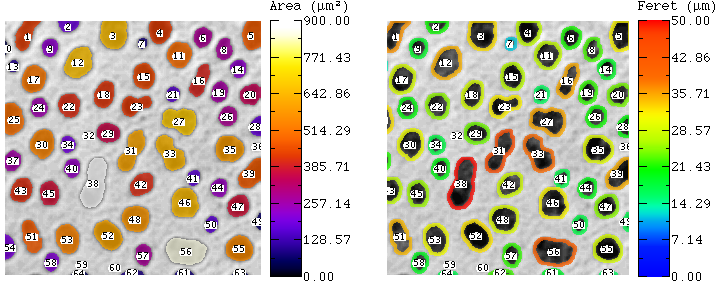
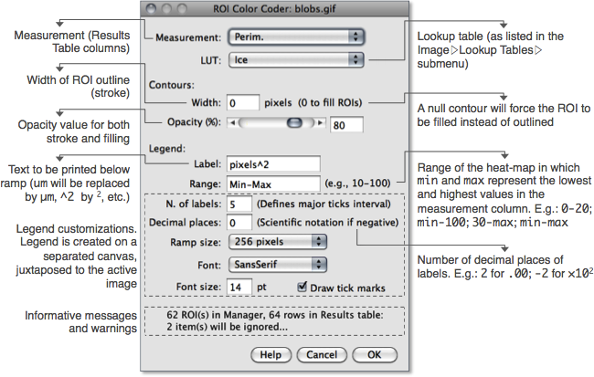

# Annotation

BARs related to annotation of images.

## Combine Orthogonal Views
Appends top, bottom and side views to a stack's XY view in a similar way to
`Image> Stacks> Ortogonal Views` but extending projected views to the entire volume rather
than displaying single slices. Empty spaces in the image canvas will be painted with
background color (frame around the Color Picker Tool in the ImageJ toolbar).

## Cumulative Z-Project
Produces cumulative projections. An immediate application of these progressive projections
is the display of trailing paths of moving particles in timelapse experiments.

## ROI Color Coder
Colorizes ROI Manager selections by matching measurements to a lookup table (LUT),
generating particle-size heat maps. More information can be found on its initial
[documentation page](http://imagejdocu.tudor.lu/doku.php?id=macro:roi_color_coder), that
has yet to be transferred to [imagej.net](http://imagej.net/).

   
   

## ROI Magnifier Tool
Magnifies the contents of a rectangular ROI and renders it inside the image canvas.

------
| [Home] | [Analysis] | [Annotation] | [Data Analysis] | [lib] | [My Routines] | [Segmentation] | [Tools] | [Utilities] | [Wiki] |

[Home]: https://github.com/tferr/Scripts
[Analysis]: https://github.com/tferr/Scripts/tree/master/BAR/src/main/resources/scripts/BAR/Analysis
[Annotation]: https://github.com/tferr/Scripts/tree/master/BAR/src/main/resources/scripts/BAR/Annotation
[Data Analysis]: https://github.com/tferr/Scripts/tree/master/BAR/src/main/resources/scripts/BAR/Data_Analysis
[lib]: https://github.com/tferr/Scripts/tree/master/BAR/src/main/resources/lib
[My Routines]: https://github.com/tferr/Scripts/tree/master/BAR/src/main/resources/scripts/BAR/My_Routines
[Segmentation]: https://github.com/tferr/Scripts/tree/master/BAR/src/main/resources/scripts/BAR/Segmentation
[Tools]: https://github.com/tferr/Scripts/tree/master/BAR/src/main/resources/tools
[Utilities]: https://github.com/tferr/Scripts/tree/master/BAR/src/main/resources/scripts/BAR/Utilities
[Wiki]: https://imagej.net/BAR
