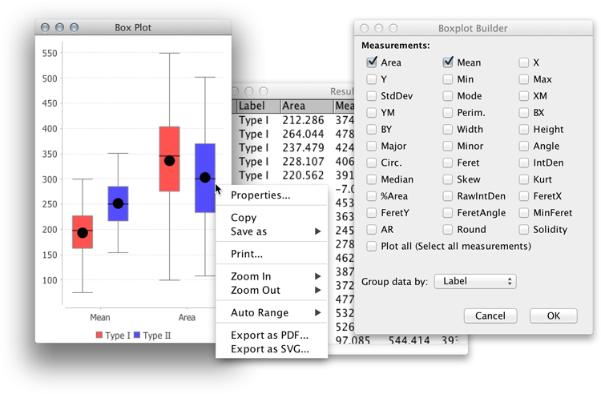
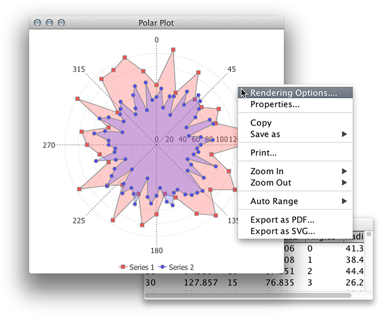
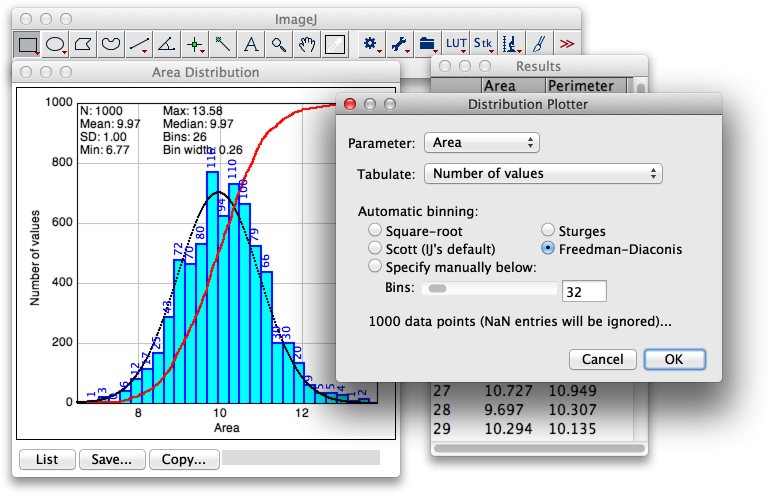
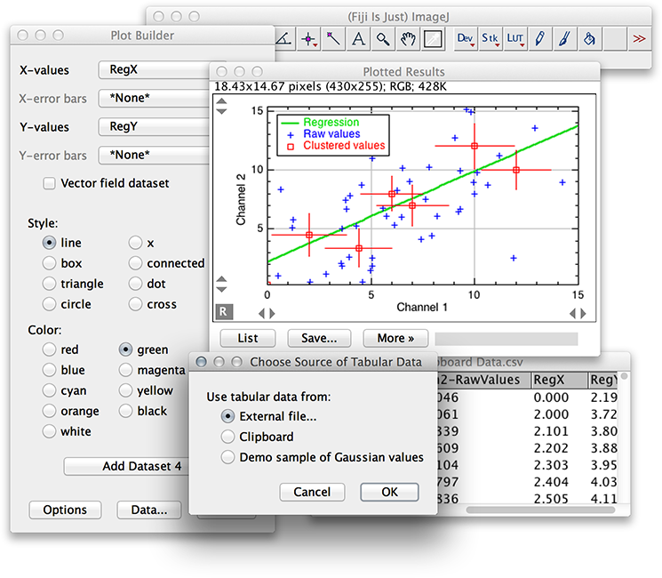

# Data Analysis

BARs related to analysis of non-image numerical data.

## Create Boxplot
Displays a [box-and-whisker](https://en.wikipedia.org/wiki/Box_plot) plot from data in an
ImageJ table using the [JFreeChart](http://www.jfree.org/jfreechart/) library, bundled
with Fiji. Data can be split into groups and plot can be exported as vector graphics.

## Create Polar Plot
Generates a polar plot from data in an ImageJ table using the
[JFreeChart](http://www.jfree.org/jfreechart/) library, bundled with Fiji. plot can be
exported as vector graphics.

## Distribution Plotter
Plots relative and cumulative frequencies of a measured parameter. Detailed functionality:
1) Retrieves relative and cumulative frequencies; 2) Fits a Normal distribution to
histogram of relative frequencies; 3) Offers several methods to determine the optimal
number of histogram bins: Square root (used by e.g., M. Excel), Sturges', Scott's (used by
`Analyze>Distribution...`) and  Freedman–Diaconis.
More information can be found on its initial
[documentation page](http://imagejdocu.tudor.lu/doku.php?id=macro:distribution_plotter),
that has yet to be transferred to [imagej.net](http://imagej.net/).

## Find Peaks
Retrieves local maxima and minima from an ImageJ plot, allowing several filtering options
such as: 1) Peak amplitude; 2) Peak height and 3) Peak width. More information can be
found on its [documentation page](https://imagej.net/Find_Peaks)

## Fit Polynomial
Fits a polynomial function (of arbitrary degree) to sampled data from an ImageJ plot using
[The Apache Commons Mathematics Library](http://commons.apache.org/proper/commons-math/)
distributed with Fiji. Features an heuristic algorithm for guessing a polynomial of 'best
fit'. It was first designed to complement the [Sholl Analysis](http://imagej.net/Sholl)
plugin.

## Interactive Plotting
_The_ interactive plotting GUI for ImageJ. Interactively creates a multi-series XY plot
(with or without error bars), from ImageJ measurements, plugin tables or imported
spreadsheet data. Multi-series vector field plots are also supported.

## NN Distances
Retrieves nearest neighbor distances from a 2D/3D list of centroid coordinates, and plots
the frequencies of calculated distances.

## Notes

 * Most of these scripts use [PlotUtils](http://tferr.github.io/Scripts/apidocs/) to
   script the [JFreeChart API](http://javadoc.imagej.net/JFreeChart/)
 * Other BAR scripts dealing with data analysis can be accessed through the Script Editor
   [templates] menu

[templates]: https://github.com/tferr/Scripts/tree/master/BAR/src/main/resources/script_templates

------
| [Home] | [Analysis] | [Annotation] | [Data Analysis] | [lib] | [My Routines] | [Segmentation] | [Tools] | [Utilities] | [Wiki] |

[Home]: https://github.com/tferr/Scripts
[Analysis]: https://github.com/tferr/Scripts/tree/master/BAR/src/main/resources/scripts/BAR/Analysis
[Annotation]: https://github.com/tferr/Scripts/tree/master/BAR/src/main/resources/scripts/BAR/Annotation
[Data Analysis]: https://github.com/tferr/Scripts/tree/master/BAR/src/main/resources/scripts/BAR/Data_Analysis
[lib]: https://github.com/tferr/Scripts/tree/master//BAR/src/main/resources/scripts/BAR/lib
[My Routines]: https://github.com/tferr/Scripts/tree/master/BAR/src/main/resources/scripts/BAR/My_Routines
[Segmentation]: https://github.com/tferr/Scripts/tree/master/BAR/src/main/resources/scripts/BAR/Segmentation
[Tools]: https://github.com/tferr/Scripts/tree/master//BAR/src/main/resources/scripts/BAR/tools
[Utilities]: https://github.com/tferr/Scripts/tree/master//BAR/src/main/resources/scripts/BAR/Utilities
[Wiki]: https://imagej.net/BAR

